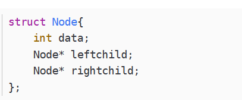

# 二叉树的种类
* 二叉搜索树\
    
    - 若它的左子树不空，则左子树上所有结点的值均小于它的根结点的值
    - 若它的右子树不空，则右子树上所有结点的值均大于它的根结点的值
    - 它的左、右子树也分别为二叉排序树
  
* 满二叉树\
    
    - 如果一颗树深度为d，最大层数为k
    - 叶子数 = 2^d
    - 节点总数 = 2^k - 1 ，k为树的深度
    - 第k层的节点数是: 2^(k-1)
  
* 完全二叉树\
    
    - 除了底层，其他层是满的；底层是连续的，底层不一定满
    - 如果一个树为满二叉树，那么它一定是一个完全二叉树

* 平衡二叉树\
  
    - 又被称为AVL树
    - 它是一棵空树或它的左右两个子树的高度差的绝对值不超过1
    - 并且左右两个子树都是一棵平衡二叉树
    - 常用实现方法有红黑树、AVL、替罪羊树、Treap、伸展树等
    - 最小二叉平衡树的节点总数的公式如下 F(n)=F(n-1)+F(n-2)+1 这个类似于一个递归的数列，可以参考Fibonacci(斐波那契)数列，1是根节点，F(n-1)是左子树的节点数量，F(n-2)是右子树的节点数量

# 二叉树的存储
* 链式存储
    - 存储结构\
    
    
    - 类似于链表，存在一个左指针，一个右指针

* 线性存储（顺序存储）
    
    - 类似于数组
    - 二叉树的顺序存储，就是用一组连续的存储单元存放二叉树中的结点
    - 必须把二叉树的所有结点安排成为一个恰当的序列，结点在这个序列中的相互位置能反映出结点之间的逻辑关系，用编号的方法从树根起，自上层至下层，每层自左至右地给所有结点编号
    - 缺点：有可能对存储空间造成极大的浪费，在最坏的情况下，一个深度为k且只有k个结点的右单支树需要2k-1个结点存储空间
    - 完全二叉树和满二叉树采用顺序存储比较合适，树中结点的序号可以唯一地反映出结点之间的逻辑关系，这样既能够最大可能地节省存储空间，又可以利用数组元素的下标值确定结点在二叉树中的位置，以及结点之间的关系
    - 给定一个i，寻找它的左右子节点：左子节点 = 2 * i + 1, 右子节点 = 2 * i + 2

# 二叉树遍历
* 深度优先遍历
    - 前序遍历：根 -> 左 -> 右
    - 中序遍历：左 -> 根 -> 右
    - 后序遍历：左 -> 右 -> 根
  
    - 可通过递归法或者迭代法来实现前中后序遍历；迭代法采用栈的方式
    - 前序遍历的迭代法，只需要一层循环，依次将'根右左'压入栈中，最后将整个栈弹出即可
    - 中序遍历可以使用一层或者两层循环，先将所有左节点压入栈中，再依次弹出左节点，在弹出的同时，需要判断同一层有没有右节点，有的话，需要将右节点压入栈中，弹出这个同层级的右节点，再弹出上一层的左节点
    - 后序遍历中，也是两层循环，但和中序遍历有点不同，元素从栈中弹出的节点，我们只能确定其左子树肯定访问完了，但是无法确定右子树是否访问过，因此，我们在后序遍历中，引入了一个prev来记录历史访问记录
* 广度优先遍历
    - 层序遍历
    - 迭代法采用队列的方式